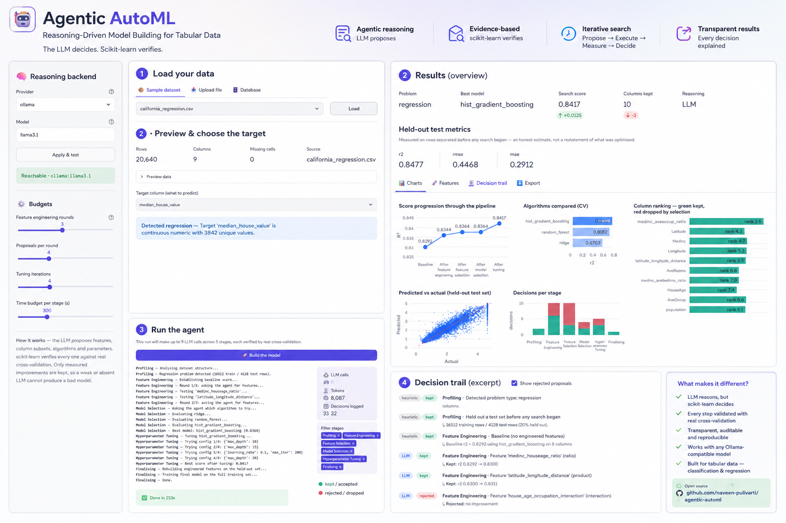

# Agentic AutoML — Reasoning-Driven Model Building for Tabular Data

An agentic AI system that automatically builds machine-learning models for
tabular data (classification & regression). An LLM **reasons** about which
features, columns, models, and hyperparameters to try; scikit-learn **verifies**
every decision against real measured performance. Only changes that genuinely
improve a metric are kept — so the agent's choices are always evidence-based.

## Core principle

> **The LLM decides; scikit-learn verifies.**

Each stage runs a loop: **propose → execute → measure → decide**, bounded by
iteration *and* wall-clock budgets so it always terminates.

## Pipeline stages

| # | Stage | LLM calls | What it does |
|---|---|---|---|
| 1 | **Data Profiling** | 0 | Types, missing values, problem-type detection. **Holds out the test set before anything else runs.** |
| 2 | **Feature Engineering** | 3 | Three rounds of proposals; each round is told the *measured* outcome of the last, so the agent stops repeating mistakes. |
| 3 | **Feature Selection** | 1 | Ten statistical methods rank every column; the agent composes candidate subsets; the best measured subset wins. |
| 4 | **Model Selection** | 1 | Shortlists algorithms (filtered by dataset size) and cross-validates each. |
| 5 | **Hyperparameter Tuning** | ≤4 | Reasons about the next configuration from the history so far — never repeating one, stopping when the space is exhausted. |

Output: the best pipeline, a set of charts, and a human-readable report
explaining every decision.

### Why the test set is split first

Every search stage optimises a cross-validation score. If the test rows took
part in that search, the final metrics would measure the *search*, not the
model — and the more candidates the agent tries, the more optimistic they get.
The split happens in profiling, before any stage sees the data, and engineered
features are rebuilt on the test set at the end using training-derived
parameters only.

## Feature selection: the ranking panel

Ranking a column is not one question with one answer, so ten methods from four
families vote:

| Family | Methods |
|---|---|
| Filter | variance, Pearson, Spearman, F-test, mutual information |
| Embedded | random-forest gain, L1 (lasso/logistic) coefficients |
| Wrapper | recursive feature elimination, permutation importance |
| Redundancy | mRMR (relevance minus redundancy) |

The agent reads where they **disagree** — a column ranked poorly by Pearson but
well by mutual information usually has a non-linear relationship — and proposes
subsets. Deterministic control subsets (all columns; top-k by mean rank) are
always evaluated too, so the LLM's contribution has to be *demonstrated*, not
assumed.

## Setup

```bash
python -m venv .venv
.venv\Scripts\activate           # Windows;  source .venv/bin/activate on Unix
pip install -r requirements.txt
python data/make_samples.py         # small sample datasets
python data/make_large_samples.py   # optional: 200k-row benchmarks (needs internet)
pytest tests/                        # full suite, runs without an LLM
streamlit run app.py
```

## Choosing the reasoning backend

Configure via environment variables, or switch live in the app's sidebar:

```bash
# Local Ollama (default, free, private)
export AUTOML_LLM_PROVIDER=ollama
export AUTOML_LLM_MODEL=llama3.1

# OR Groq free tier — much faster
export AUTOML_LLM_PROVIDER=groq
export AUTOML_LLM_MODEL=llama-3.1-8b-instant
export GROQ_API_KEY=your_key_here
```

The code is model-agnostic: nothing outside `src/agent/llm.py` knows which
backend is in use.

## Working at scale

Search stages run many cross-validations, so on large data they are the
bottleneck. Three things happen automatically:

- data is **sampled to 20,000 rows with a fixed seed** for search only (so every
  candidate is judged on identical rows), then the chosen pipeline is trained on
  everything;
- **histogram gradient boosting** replaces the classic implementation above
  10,000 rows;
- **SVM and KNN are excluded** on large data, where they would turn a
  five-minute run into an overnight one.

Verified end-to-end on 200,000-row datasets (Forest Cover Type, SGEMM GPU
kernel performance).

## Benchmarks

```bash
python benchmarks/bench.py <label>        # the 5 small datasets
python benchmarks/bench_large.py <label>  # the 200k-row datasets
python benchmarks/probe_llm.py            # one-call LLM latency/quality probe
```

Results land in `benchmarks/results/`.

## Project structure

```
app.py                     Streamlit UI
src/
  config.py                central configuration + budgets
  data/loader.py           CSV / Excel / SQL -> DataFrame
  data/profiler.py         Stage 1: profiling + problem-type detection
  agent/llm.py             model-agnostic reasoning layer (+ partial-output salvage)
  agent/schemas.py         Pydantic schemas, whitelists, structural validation
  agent/state.py           shared pipeline state
  agent/graph.py           LangGraph orchestration (+ sequential fallback)
  stages/feature_engineering.py   Stage 2
  stages/feature_selection.py     Stage 3
  stages/model_selection.py       Stage 4
  stages/tuning.py                Stage 5
  ml/trainer.py            the verification layer (training + real metrics)
  ml/feature_ops.py        whitelisted operations + dataset-aware validation
  ml/feature_ranking.py    the ten-method ranking panel
  report/generator.py      explainability report
  report/charts.py         Plotly figures for the UI and report
  utils/budget.py          per-stage wall-clock budgets
  utils/logger.py          logging + local token tracking
data/make_samples.py       small sample datasets + demo.db
data/make_large_samples.py 200k-row real benchmarks
tests/test_e2e.py          end-to-end + safety-property tests
benchmarks/                reproducible measurement harness
```

## Notes

- **Tabular data only** (CSV/Excel/SQL). No images/text/audio, no deep learning.
- All tools are free / open-source. A paid API can be substituted via the
  model-agnostic layer if desired.
- The system produces a valid result even with **no LLM available**, using
  deterministic heuristic fallbacks — the core reliability guarantee. The report
  always states honestly which stages actually used the LLM.

## APP UI

